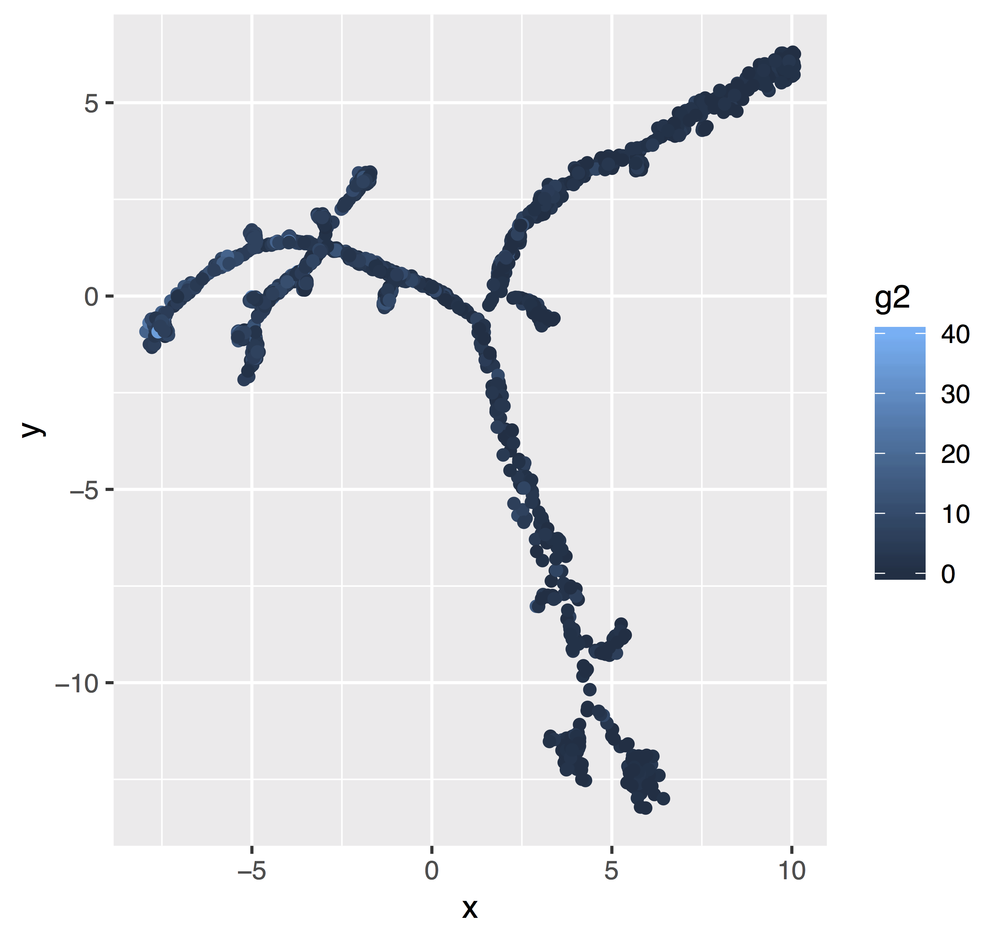
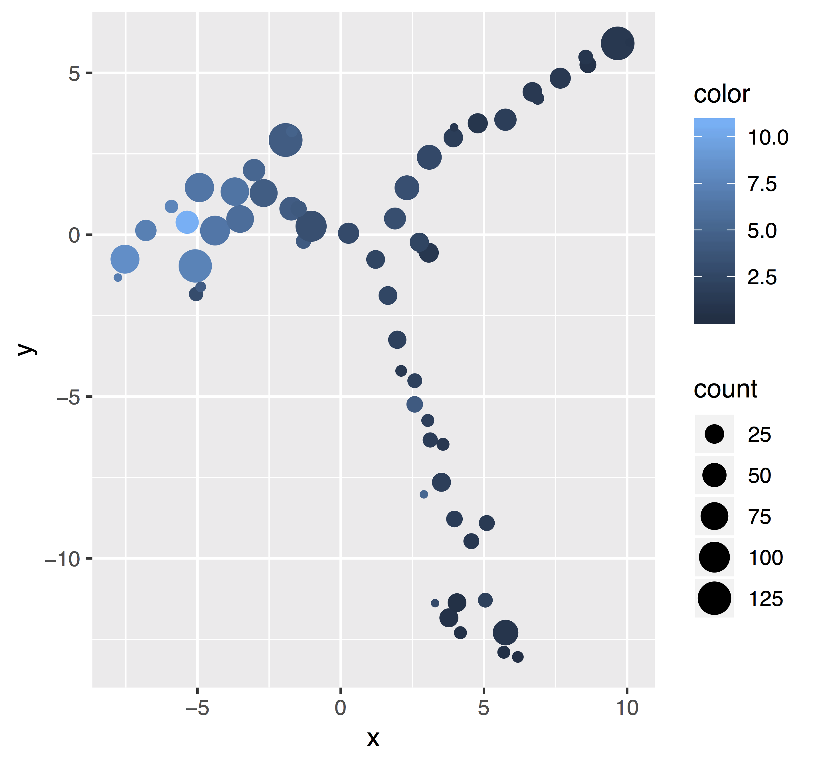

    
`bubblegrid` helps you see your data when a plain scatterplot would be overplotted. To do that, it aggregates points within a hexagonal grid, then shows the point count as the bubble size. It also shows the intensity (e.g. gene expression) via color. The intensity / gene expression is averaged within bins.
    
    devtools::install_github("maehrlab/bubblegrid")
    library("bubblegrid")
    data(test_data)
    bubblegrid(x = test_data[[1]], y = test_data[[2]], color = test_data[[3]])

